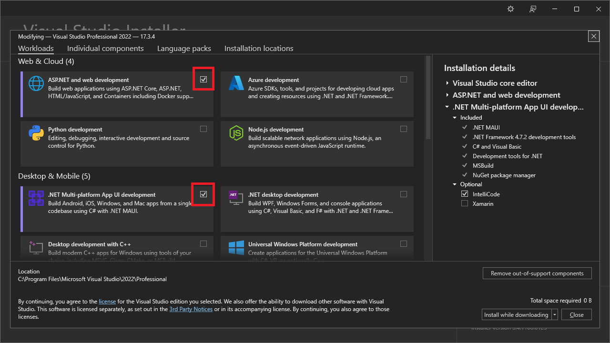
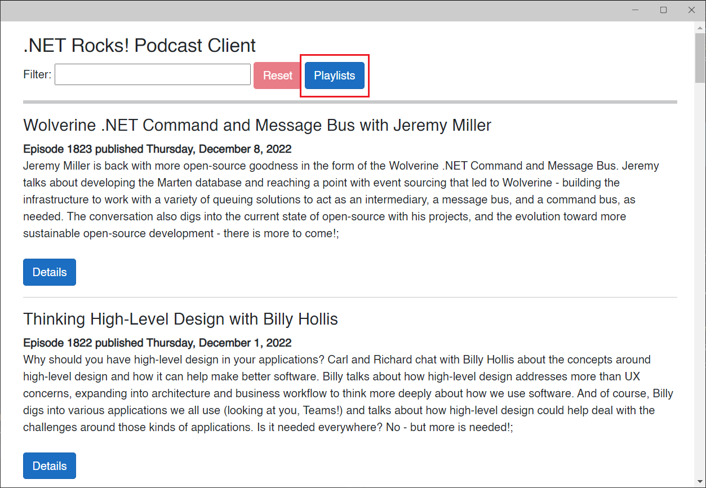
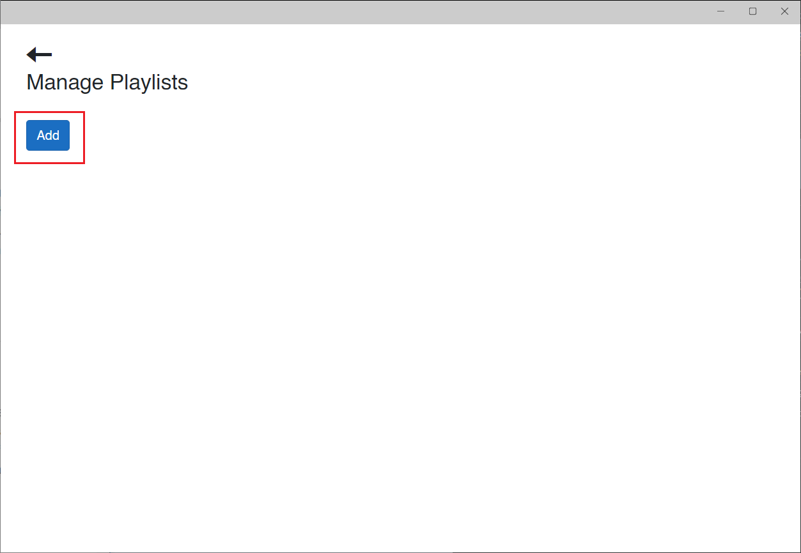
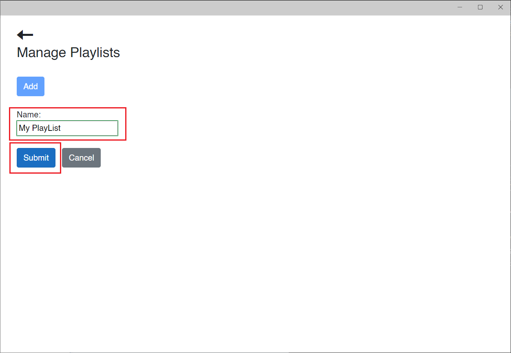
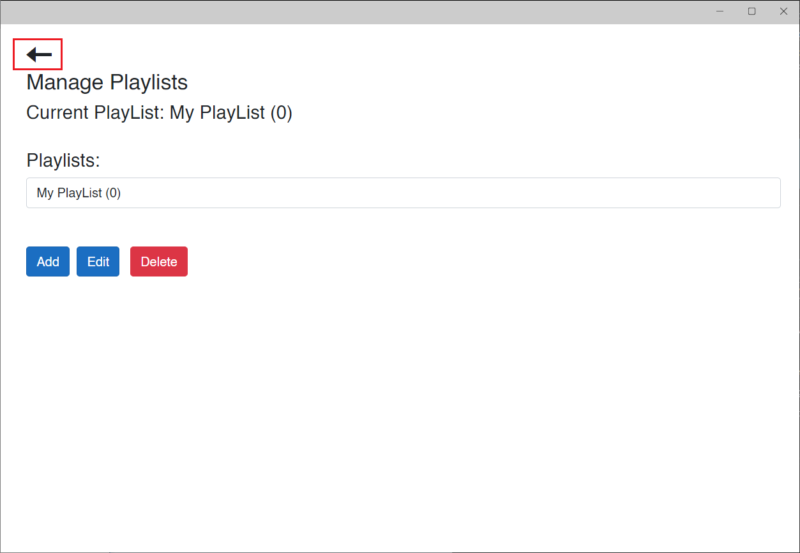
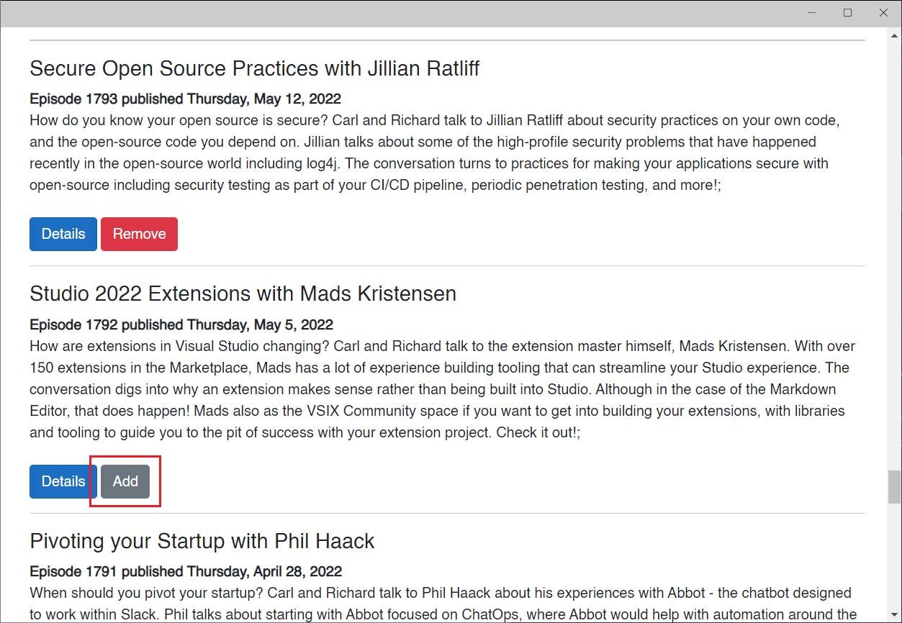
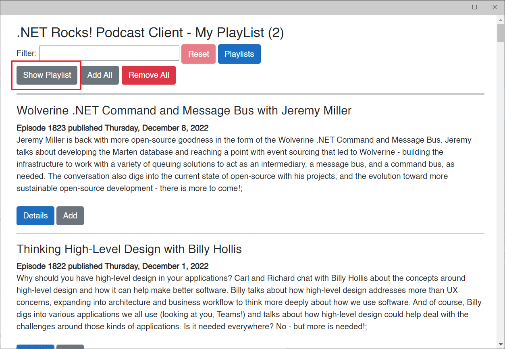
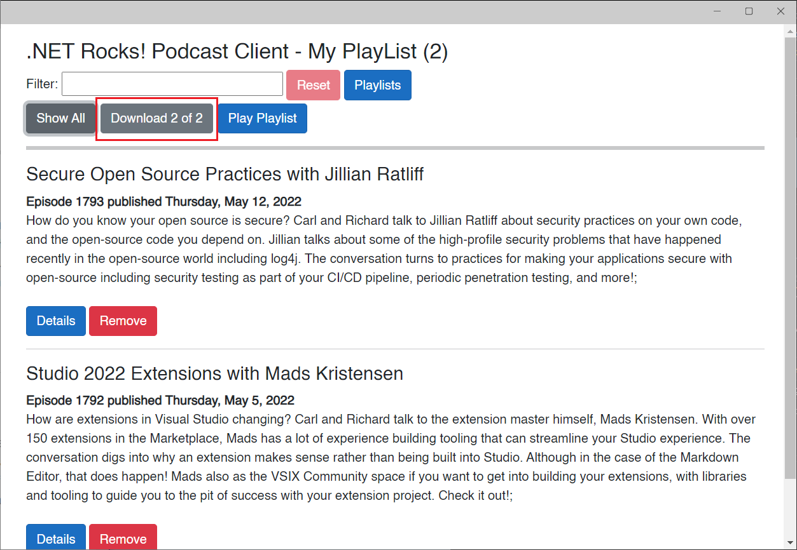
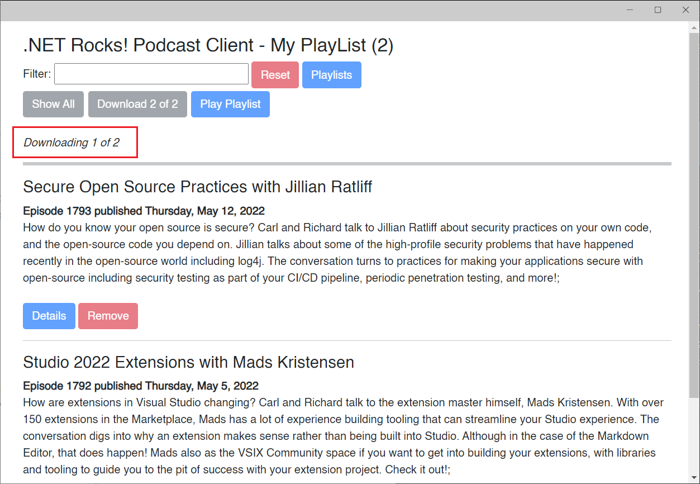
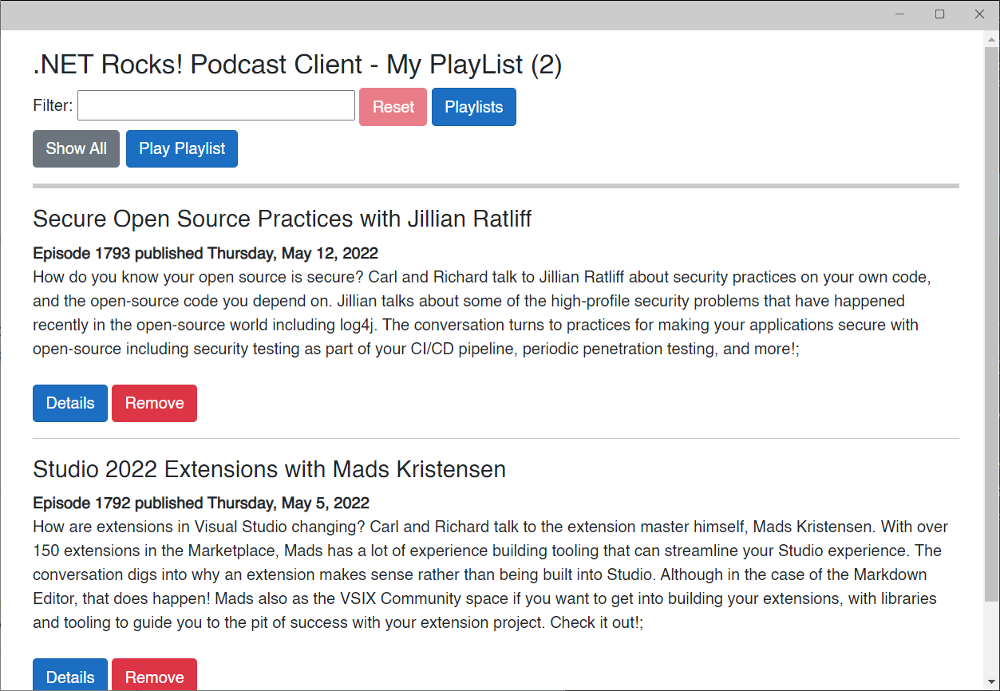

# Building a Mobile Podcast Client App in MAUI Blazor Part 4

## Overview

In episode 28 of [The .NET Show](https://www.thedotnetshow.com/), I started building a Podcast Client MAUI app using Blazor as the UI for my long-running podcast, [.NET Rocks](https://www.dotnetrocks.com/). In episode 30 I added guest info and links to the Details page. I also got a head start on the Playlist functionality, which allows the user to manage and use playlists (lists of shows that should play one-after another). In episode 30, I implemented the playlist functionality. In this episode we'll add a feature to pre-download the playlist audio files and metadata.

This is the fourth in a series of episodes where we take this app from nothing all the way to the app store.

This type of app is called a Mobile Hybrid app. Yes, we're using Blazor, a web UI technology, but the code has access to the native platform: Windows, MacOS, iOS, and Android.

### GitHub Repos: 

- https://github.com/carlfranklin/MAUIDnr1 (Episode 28)
- https://github.com/carlfranklin/MAUIDnr2 (Episode 30)
- https://github.com/carlfranklin/MAUIDnr3 (Episode 31)
- https://github.com/carlfranklin/MAUIDnr4 (Episode 32)

### Prerequisites

Install the latest version of Visual Studio 2022 and select the `Web & Cloud` and `Desktop & Mobile` workloads.



#### Start with the `MAUIDnr3` MAUI Blazor App from episode 31

Clone the repo at https://github.com/carlfranklin/MAUIDnr3 or rebuild it from scratch using the instructions in the README file.

#### We need a new Show model property

When developing this version, I needed a quick way to get the MP3 URLfor each show to support the pre-downloading of playlist shows. I need to look at all of the shows in a playlist and determine whether or not the MP3 file is already downloaded. Before this episode, I was not retrieving the URL with the show information. I had to modify the API controller as well as our back-end CMS system to include the URL in each show. It was very easy to modify the SELECT query to return the URL, and that made the whole system much easier and faster.

Replace the *Models/Show.cs* file with the following:

```c#
namespace MAUIDnr1.Models;
public class Show
{
    public int Id { get; set; }
    public bool Enabled { get; set; }
    public int ShowNumber { get; set; }
    public string ShowTitle { get; set; } = "";
    public string Description { get; set; } = "";
    public DateTime DateRecorded { get; set; } = DateTime.Now;
    public DateTime DatePublished { get; set; } = DateTime.Now;
    public string Mp3Url { get; set; } = "";
    public string ShowDateString { get; set; } = "";
    public string DayOfWeek { get; set; } = "";
    public string Notes { get; set; } = "";
    public ShowDetails ShowDetails { get; set; } = new ShowDetails();
    public string ListDisplayString
    {
        get
        {
            return ShowNumber.ToString() + " - " + ((DateTime)DatePublished).ToShortDateString() + " - " + ShowTitle;
        }
    }
}
```

The only real difference is this line:

```c#
public string Mp3Url { get; set; } = "";
```

#### Add Global Usings to MauiProgram.cs

Replace *MauiProgram.cs* with the following:

```c#
global using Plugin.Maui.Audio;
global using MAUIDnr1.Services;
global using MAUIDnr1.Models;
global using Microsoft.AspNetCore.Components;
global using Microsoft.JSInterop;
global using Newtonsoft.Json;
global using System.Collections.ObjectModel;
global using System.Text;
using Microsoft.AspNetCore.Components.WebView.Maui;

namespace MAUIDnr1;

public static class MauiProgram
{
    public static MauiApp CreateMauiApp()
    {
        var builder = MauiApp.CreateBuilder();
        builder
            .UseMauiApp<App>()
            .ConfigureFonts(fonts =>
            {
                fonts.AddFont("OpenSans-Regular.ttf", "OpenSansRegular");
            });

        builder.Services.AddMauiBlazorWebView();
#if DEBUG
        builder.Services.AddBlazorWebViewDeveloperTools();
#endif
        builder.Services.AddSingleton(AudioManager.Current);
        builder.Services.AddSingleton<ApiService>();
        return builder.Build();
    }
}
```

#### Fix a bug in ApiService.cs

The `GetShowWithDetails` method, when online, saves the show information to a local JSON file, but does not save the guest images. So I added code to save the guest images.

When offline, the images are loaded and encoded as base64, so they can be shown. You can't directly link to an image file in the cache folder.

Replace the `GetShowWithDetails` method in *ApiService.cs* with the following:

```c#
public async Task<Show> GetShowWithDetails(int ShowNumber)
{
    var fileName = $"{FileSystem.Current.CacheDirectory}\\show-{ShowNumber}.json";
    try
    {
        if (AppState.IsOnline)
        {
            // We have an Internet connection. Download as usual
            string Url = $"{ShowName}/{ShowNumber}/getwithdetails";
            var result = await httpClient.GetAsync(Url);
            result.EnsureSuccessStatusCode();
            var response = await result.Content.ReadAsStringAsync();
            var show = JsonConvert.DeserializeObject<Show>(response);

            // save the json file offline
            System.IO.File.WriteAllText(fileName, response);

            // download and save the guest image
            foreach (var guest in show.ShowDetails.Guests)
            {
                var justFileName = Path.GetFileName(guest.PhotoUrl);
                var photoFileName = $"{FileSystem.Current.CacheDirectory}\\show-{ShowNumber}-{justFileName}";
                using var httpResponse = await httpClient.GetAsync(guest.PhotoUrl).ConfigureAwait(false);
                var bytes = await httpResponse.Content.ReadAsByteArrayAsync().ConfigureAwait(false);
                System.IO.File.WriteAllBytes(photoFileName, bytes);
            }

            return show;
        }
        else if (System.IO.File.Exists(fileName))
        {
            // We are offline and the json file exists. Load it and return
            var json = System.IO.File.ReadAllText(fileName);
            var show = JsonConvert.DeserializeObject<Show>(json);
            // return null if there are no details
            if (show.ShowDetails == null)
                return null;
            else
            {
                foreach (var guest in show.ShowDetails.Guests)
                {
                    var justFileName = Path.GetFileName(guest.PhotoUrl);
                    var photoFileName = $"{FileSystem.Current.CacheDirectory}\\show-{ShowNumber}-{justFileName}";
                    var imageBytes = System.IO.File.ReadAllBytes(photoFileName);
                    var imageSource = Convert.ToBase64String(imageBytes);
                    imageSource = string.Format("data:image/png;base64,{0}", imageSource);
                    guest.PhotoUrl = imageSource;
                }
                return show;
            }
        }
        else
        {
            return new Show();
        }
    }
    catch (Exception ex)
    {
        return new Show();
    }
}
```

#### Fix a bug in PlayList.razor.cs

Replace *PlayList.razor.cs* with the following:

```c#
namespace MAUIDnr1.Pages;
public partial class Playlists : ComponentBase
{
    [Inject]
    private NavigationManager _navigationManager { get; set; }

    [Inject]
    private IJSRuntime JSRuntime { get; set; }

    // are we adding, editing, or neither?
    protected PlaylistEditAction PlaylistEditAction { get; set; }

    // used to disable the command buttons if we're adding or editing
    protected bool CommandButtonsDisabled =>
        PlaylistEditAction != PlaylistEditAction.None;

    // This is the PlayList object we use to add or edit
    protected PlayList PlayListToAddOrEdit;

    /// <summary>
    /// Called from the UI to move a show up in the playlist order
    /// </summary>
    /// <param name="show"></param>
    protected void MoveUp(Show show)
    {
        var index = PlayListToAddOrEdit.Shows.IndexOf(show);
        PlayListToAddOrEdit.Shows.RemoveAt(index);
        PlayListToAddOrEdit.Shows.Insert(index - 1, show);
    }

    /// <summary>
    /// Called from the UI to move a show down in the playlist order
    /// </summary>
    /// <param name="show"></param>
    protected void MoveDown(Show show)
    {
        var index = PlayListToAddOrEdit.Shows.IndexOf(show);
        PlayListToAddOrEdit.Shows.RemoveAt(index);
        PlayListToAddOrEdit.Shows.Insert(index + 1, show);
    }

    /// <summary>
    /// Go back
    /// </summary>
    protected void NavigateHome()
    {
        _navigationManager.NavigateTo("/");
    }

    /// <summary>
    /// Set the selected playlist when selected from the <select> element
    /// </summary>
    /// <param name="args"></param>
    protected async Task PlayListSelected(ChangeEventArgs args)
    {
        AppState.SelectedPlayList = (from x in AppState.PlayLists
                                     where x.Id.ToString() == args.Value.ToString()
                                     select x).FirstOrDefault();
        if (AppState.ShowPlayListOnly)
        {
            AppState.ToggleShowPlaylistOnly();
        }
    }

    /// <summary>
    /// Because PlayListSelected won't fire when there is only one item in the list
    /// </summary>
    protected async Task PlayListsClicked()
    {
        if (AppState.PlayLists.Count == 1)
        {
            AppState.SelectedPlayList = AppState.PlayLists.First();
            if (AppState.ShowPlayListOnly)
            {
                AppState.ToggleShowPlaylistOnly();
            }
        }
    }

    /// <summary>
    /// Add a PlayList
    /// </summary>
    protected async Task AddButtonClicked()
    {
        // Create a new PlayList
        PlayListToAddOrEdit = new PlayList();
        PlayListToAddOrEdit.Id = PlayList.CreateGuid(); // don't forget this!
        PlayListToAddOrEdit.DateCreated = DateTime.Now;
        PlaylistEditAction = PlaylistEditAction.Adding;
        await JSRuntime.InvokeVoidAsync("SetFocus", "InputName");
    }

    /// <summary>
    /// Edit the SelectedPlayList
    /// </summary>
    protected async Task EditButtonClicked()
    {
        // Clone it, so we don't clobber it accidentally.
        PlayListToAddOrEdit = (PlayList)AppState.SelectedPlayList.Clone();
        PlaylistEditAction = PlaylistEditAction.Editing;
        await JSRuntime.InvokeVoidAsync("SetFocus", "InputName");
    }

    /// <summary>
    /// Easy Peasy
    /// </summary>
    protected void DeleteButtonClicked()
    {
        AppState.PlayLists.Remove(AppState.SelectedPlayList);
        AppState.SavePlaylists();
        AppState.SelectedPlayList = null;
        PlaylistEditAction = PlaylistEditAction.None;
        if (AppState.ShowPlayListOnly)
        {
            AppState.ToggleShowPlaylistOnly();
        }
    }

    /// <summary>
    /// Commit the Add or Edit action
    /// </summary>
    protected void SubmitPlayListClicked()
    {
        if (PlaylistEditAction == PlaylistEditAction.Adding)
        {
            // Simply add the new PlayList.
            AppState.PlayLists.Add(PlayListToAddOrEdit);
            // Select it
            int index = AppState.PlayLists.IndexOf(PlayListToAddOrEdit);
            AppState.SelectedPlayList = AppState.PlayLists[index];
        }
        else if (PlaylistEditAction == PlaylistEditAction.Editing)
        {
            // Get the index of the selected play list
            int index = AppState.PlayLists.IndexOf(AppState.SelectedPlayList);
            // Replace it in the list
            AppState.PlayLists[index] = PlayListToAddOrEdit;
            // Get the new object reference
            AppState.SelectedPlayList = AppState.PlayLists[index];
        }
        // Save the data!
        AppState.SavePlaylists();
        PlaylistEditAction = PlaylistEditAction.None;
    }

    /// <summary>
    /// Easy Peasy
    /// </summary>
    protected void CancelButtonPressed()
    {
        PlayListToAddOrEdit = null;
        PlaylistEditAction = PlaylistEditAction.None;
    }
}
```

I added this code to `PlayListSelected`, `PlayListsClicked`, and `DeleteButtonClicked`:

```c#
if (AppState.ShowPlayListOnly)
{
    AppState.ToggleShowPlaylistOnly();
}
```

This makes sure that our main page shows the right buttons and button text when we navigate back to it.

#### Update Details code to support new Mp3Url property

Replace *Details.razor.cs* with the following:

```c#
namespace MAUIDnr1.Pages;
public partial class Details : ComponentBase
{
    [Inject]
    private ApiService _apiService { get; set; }

    [Inject]
    private NavigationManager _navigationManager { get; set; }

    [Inject]
    private IAudioManager _audioManager { get; set; }

    [Parameter]
    public string ShowNumber { get; set; }

    protected bool PlayingPlayList = false; // set true when playing through a playlist
    protected int PlaylistShowIndex = 0;    // 1-based index of currently playing show
    protected int PlaylistShowCount = 0;    // total number of shows in the playlist

    protected Show ThisShow { get; set; }

    protected IAudioPlayer? player = null;       // media player
    protected FileStream? stream = null;         // stream used for playing
    protected MediaState mediaState;
    //protected string url = "";                // Removed. Using ThisShow.ShowDetails.File.Url instead
    protected string AudioMessage = "";         // Downloading, Playing, Paused or error
    protected double Percentage = 0;            // percentage of audio played used to set progress bar value
    protected string ProgressPercent = "";      // formatted percentage string (not shown in this demo)
    protected string PlayPosition = "";         // calculated from current position
    protected string ControlsOpacity = ".5";    // .5 for 'disabled' 
    protected string PlayOpacity = "1";         // 1 for 'enabled'
    protected string playButtonClass = "imageButton";   // image reacts when pressed
    protected string pauseButtonClass = "";     // see SetState to see these classes in action
    protected string stopButtonClass = "";
    protected string rewindButtonClass = "";
    protected string forwardButtonClass = "";
    private System.Timers.Timer? timer = null;   // Used to report current position

    /// <summary>
    /// Change UI depending on the state
    /// </summary>
    /// <param name="state"></param>
    private void SetState(MediaState state)
    {
        mediaState = state;
        if (state == MediaState.Playing)
        {
            ControlsOpacity = "1";
            PlayOpacity = ".5";
            AudioMessage = "Playing";
            playButtonClass = "";
            pauseButtonClass = "imageButton";
            stopButtonClass = "imageButton";
            rewindButtonClass = "imageButton";
            forwardButtonClass = "imageButton";
        }
        else if (state == MediaState.Paused || state == MediaState.Stopped)
        {
            ControlsOpacity = ".5";
            PlayOpacity = "1";
            playButtonClass = "imageButton";
            pauseButtonClass = "";
            stopButtonClass = "";
            rewindButtonClass = "";
            forwardButtonClass = "";
            if (state == MediaState.Stopped)
            {
                Percentage = 0;
                AudioMessage = "";
                PlayPosition = "";
            }
            else
            {
                AudioMessage = "Paused";
            }
        }
    }

    protected async Task NavigateHome()
    {
        await Cleanup();
        PlayingPlayList = false;
        _navigationManager.NavigateTo("/");
    }

    /// <summary>
    /// Called from the Play button
    /// </summary>
    /// <returns></returns>
    protected async Task PlayAudio()
    {
        // ignore if we're already playing
        if (mediaState == MediaState.Playing) return;

        // are we paused?
        if (mediaState == MediaState.Paused && player != null)
        {
            // yes. Continue playing
            player.Play();
            SetState(MediaState.Playing);
            return;
        }

        // exit if there is no url specified
        if (string.IsNullOrEmpty(ThisShow.Mp3Url))
        {
            AudioMessage = "Please enter a URL to an MP3 file";
            return;
        }

        // here we go!
        try
        {
            // This is where we are storing local audio files
            string cacheDir = FileSystem.Current.CacheDirectory;

            // get the fully qualified path to the local file
            var fileName = ThisShow.Mp3Url.Substring(8).Replace("/", "-");
            var localFile = $"{cacheDir}\\{fileName}";

            // download if need be
            if (!System.IO.File.Exists(localFile))
            {
                // let the user know we're trying to download
                AudioMessage = "Downloading...";
                await InvokeAsync(StateHasChanged);

                // this code downloads the file from the URL
                using (var client = new HttpClient())
                {
                    var uri = new Uri(ThisShow.Mp3Url);
                    var response = await client.GetAsync(ThisShow.Mp3Url);
                    response.EnsureSuccessStatusCode();
                    using (var stream = await response.Content.ReadAsStreamAsync())
                    {
                        var fileInfo = new FileInfo(localFile);
                        using (var fileStream = fileInfo.OpenWrite())
                        {
                            await stream.CopyToAsync(fileStream);
                        }
                    }
                }
            }

            // File exists now. Read it
            stream = System.IO.File.OpenRead(localFile);

            // create the audio player
            player = _audioManager.CreatePlayer(stream);

            // handle the PlaybackEnded event
            player.PlaybackEnded += Player_PlaybackEnded;

            // create a timer to report progress
            timer = new System.Timers.Timer(50);

            // handle the Elapsed event
            timer.Elapsed += async (state, args) =>
            {
                // calculate the percentage complete
                Percentage = (player.CurrentPosition * 100) / player.Duration;

                // Not used, but if you want to show the percent completed...
                ProgressPercent = Percentage.ToString("N2") + "%";

                // calculate the PlayPosition string to report "current time / total time"
                var tsCurrent = TimeSpan.FromSeconds(player.CurrentPosition);
                var tsTotal = TimeSpan.FromSeconds(player.Duration);
                var durationString = $"{tsTotal.Minutes.ToString("D2")}:{tsTotal.Seconds.ToString("D2")}";
                var currentString = $"{tsCurrent.Minutes.ToString("D2")}:{tsCurrent.Seconds.ToString("D2")}";
                PlayPosition = $"{currentString} / {durationString}";

                // update the UI
                await InvokeAsync(StateHasChanged);
            };

            // start the timer
            timer.Start();
            // start playing
            player.Play();
            // configure the UI for playing
            SetState(MediaState.Playing);
            // update the UI
            await InvokeAsync(StateHasChanged);

        }
        catch (Exception e)
        {
            AudioMessage = "An error occurred. Please try again later.";
        }
    }

    /// <summary>
    /// Skip forward 10 seconds
    /// </summary>
    protected void Forward()
    {
        if (mediaState == MediaState.Playing)
        {
            var pos = player.CurrentPosition + 10;
            if (pos < player.Duration)
                player.Seek(pos);
            else
                StopAudio();
        }
    }

    /// <summary>
    /// Stop
    /// </summary>
    protected void StopAudio()
    {
        if (mediaState == MediaState.Playing)
        {
            PlayingPlayList = false;
            player.Stop();
            SetState(MediaState.Stopped);
        }
    }

    /// <summary>
    /// Pause
    /// </summary>
    protected void PauseAudio()
    {
        if (mediaState == MediaState.Playing)
        {
            player.Pause();
            SetState(MediaState.Paused);
        }
    }

    /// <summary>
    /// Rewind 10 seconds (or to the beginning)
    /// </summary>
    protected void Rewind()
    {
        if (mediaState == MediaState.Playing)
        {
            var pos = player.CurrentPosition - 10;
            if (pos < 0)
                pos = 0;
            player.Seek(pos);
        }
    }

    private async Task Cleanup()
    {
        // Update the UI
        SetState(MediaState.Stopped);
        // dispose the stream
        stream?.Dispose();
        // stop and dispose the timer
        timer?.Stop();
        timer?.Dispose();
        // unhook this event 
        if (player != null)
        {
            player.PlaybackEnded -= Player_PlaybackEnded;
            // dispose the player
            player.Dispose();
        }
        // update the ui
        await InvokeAsync(StateHasChanged);
    }

    /// <summary>
    /// for testing
    /// </summary>
    protected void Scoot()
    {
        if (mediaState == MediaState.Playing)
        {
            // go almost to the end
            player.Seek(player.Duration - 3);
        }
    }

    /// <summary>
    /// Tear down everything when playback ends
    /// </summary>
    /// <param name="sender"></param>
    /// <param name="e"></param>
    protected async void Player_PlaybackEnded(object sender, EventArgs e)
    {
        await Cleanup();
        if (PlayingPlayList)
        {
            await GetNextShowInPlaylist();
            if (PlaylistShowIndex > 0)
                await PlayAudio();
            else
            {
                // go back home
                NavigateHome();
            }
        }
    }

    /// <summary>
    /// When playing a playlist, sets ThisShow to the next show in the playlist
    /// It also loads the show details
    /// </summary>
    /// <returns></returns>
    private async Task GetNextShowInPlaylist()
    {
        // is this the last show in the playlist?
        if (ThisShow.ShowNumber == AppState.SelectedPlayList.Shows.Last().ShowNumber)
        {
            // This is a signal that we're done playing
            PlaylistShowIndex = 0;
            return;
        }
        // Get the next show from the playlist
        var nextShow = AppState.SelectedPlayList.Shows[PlaylistShowIndex];
        // Check the online status
        AppState.GetOnlineStatus();
        // Increment the show index (1-based index)
        PlaylistShowIndex++;
        // Get the show with the details
        ThisShow = await _apiService.GetShowWithDetails(nextShow.ShowNumber);
    }

    protected override async Task OnInitializedAsync()
    {
        if (ShowNumber != null && ShowNumber != "playlist")
        {
            // load the details for the specified show number
            try
            {
                int showNumber = Convert.ToInt32(ShowNumber);
                AppState.GetOnlineStatus();
                ThisShow = await _apiService.GetShowWithDetails(showNumber);
            }
            catch (Exception ex)
            {
            }
        }
        else if (ShowNumber == "playlist")
        {
            // load and play the selected playlist
            try
            {
                // do we have a selected playlist, and are there shows in it?
                if (AppState.SelectedPlayList == null) return;
                if (AppState.SelectedPlayList.Shows.Count == 0) return;
                // All systems are go!
                PlayingPlayList = true;
                AppState.GetOnlineStatus();
                // get the first show in the PlayList
                var showNumber = AppState.SelectedPlayList.Shows.First().ShowNumber;
                // get the show with the details
                ThisShow = await _apiService.GetShowWithDetails(showNumber);

                if (ThisShow != null)
                {
                    // set the count (for the UI)
                    PlaylistShowCount = AppState.SelectedPlayList.Shows.Count;
                    // set the index (for the UI)
                    PlaylistShowIndex = 1;
                    // Play!
                    await PlayAudio();
                }
            }
            catch (Exception ex)
            {
            }
        }
    }
}
```

I just replaced this:

```c#
ThisShow.ShowDetails.File.Url
```

with this:

```
ThisShow.Mp3Url
```

#### Update Index Code

Replace *Index.razor.cs* with the following:

```c#
namespace MAUIDnr1.Pages;
public partial class Index : ComponentBase
{
    [Inject]
    private NavigationManager _navigationManager { get; set; }

    [Inject]
    private ApiService _apiService { get; set; }

    // we read 20 records at a time when loading more shows
    private int RecordsToRead { get; set; } = 20;

    protected string StatusMessage {get; set;} = string.Empty;

    protected bool Downloading = false;

    /// <summary>
    /// EpisodeFilter needs to be defined here in Index
    /// because it needs to call StateHasChanged after
    /// being set. We are using the AppState.EpisodeFilter
    /// string property as a backing field, so the state
    /// of the property will be maintained between navigations.
    /// </summary>
    protected string EpisodeFilter
    {
        get => AppState.EpisodeFilter;
        set
        {
            if (AppState.EpisodeFilter != value)
            {
                // Make sure we are showing all the shows
                AppState.ShowPlayListOnly = false;
                AppState.ShowPlayListOnlyText = "Show Playlist";

                AppState.EpisodeFilter = value;
                AppState.LastShowNumber = 0;
                AppState.AllShows.Clear();
                try
                {
                    // Are we online?
                    AppState.GetOnlineStatus();

                    // Call GetNextBatchOfShows asynchronously
                    var t = Task.Run(() => GetNextBatchOfShows());
                    t.Wait();

                    // Update the UI
                    StateHasChanged();
                }
                catch { }
            }
        }
    }

    public bool IsDownloaded(Show show)
    {
        // exit if there is no url specified
        if (!string.IsNullOrEmpty(show.Mp3Url))
        {
            // This is where we are storing local audio files
            string cacheDir = FileSystem.Current.CacheDirectory;

            // get the fully qualified path to the local file
            var fileName = show.Mp3Url.Substring(8).Replace("/", "-");
            var localFile = $"{cacheDir}\\{fileName}";

            return System.IO.File.Exists(localFile);
        }
        else
            return false;
    }

    public int PlaylistEpisodesNotDownloaded
    {
        get
        {
            if (AppState.SelectedPlayList == null) 
                return 0;
            var count = 0;
            foreach (var show in AppState.SelectedPlayList.Shows)
            {
                if (!IsDownloaded(show))
                {
                    count++;
                }
            }
            return count;
        }
    }

    public async Task DownloadPlaylist()
    {
        if (!AppState.IsOnline) return;
        if (AppState.SelectedPlayList == null) return;
        Downloading = true;

        // This is where we are storing local audio files
        string cacheDir = FileSystem.Current.CacheDirectory;
        int count = 0;
        int total = PlaylistEpisodesNotDownloaded;
        foreach (var show in AppState.SelectedPlayList.Shows)
        {
            if (!IsDownloaded(show))
            {
                // download to cache
                count++;
                StatusMessage = $"Downloading {count} of {total}";
                await InvokeAsync(StateHasChanged);

                // Download the show with details so the data is cached
                var thisShow = await 
                    _apiService.GetShowWithDetails(show.ShowNumber);

                // get the fully qualified path to the local file
                var fileName = show.Mp3Url.Substring(8).Replace("/", "-");
                var localFile = $"{cacheDir}\\{fileName}";

                // this code downloads the file from the URL
                using (var client = new HttpClient())
                {
                    var uri = new Uri(show.Mp3Url);
                    var response = await client.GetAsync(show.Mp3Url);
                    response.EnsureSuccessStatusCode();
                    using (var stream = await response.Content.ReadAsStreamAsync())
                    {
                        var fileInfo = new FileInfo(localFile);
                        using (var fileStream = fileInfo.OpenWrite())
                        {
                            await stream.CopyToAsync(fileStream);
                        }
                    }
                }
            }
        }
        StatusMessage = "";
        Downloading = false;
    }

    protected void PlaySelectedPlayList()
    {
        var url = $"details/playlist";
        _navigationManager.NavigateTo(url);
    }


    /// <summary>
    /// Disable the reset (filter) button if the
    /// EpisodeFilter property is not set
    /// </summary>
    protected bool ResetButtonDisabled
    {
        get => (EpisodeFilter == "");
    }

    /// <summary>
    /// Reset button was selected
    /// </summary>
    protected void ResetFilter()
    {
        // Make sure we are showing all the shows
        AppState.ShowPlayListOnly = false;
        AppState.ShowPlayListOnlyText = "Show Playlist";

        // Clear the show data and episode filter
        AppState.ShowNumbers.Clear();
        AppState.AllShows.Clear();
        EpisodeFilter = "";
    }

    /// <summary>
    /// Adds to the existing list of shows (AllShows) based on the filter
    /// </summary>
    /// <returns></returns>
    protected async Task GetNextBatchOfFilteredShows()
    {
        // get the next batch
        var nextBatch = await
            _apiService.GetFilteredShows(EpisodeFilter,
                AppState.AllShows.Count, RecordsToRead);

        // bail if we didn't return any
        if (nextBatch == null || nextBatch.Count == 0) return;

        // Add them to the list.
        // NOTE: ObservableCollection<> does not implement AddRange
        foreach (var show in nextBatch)
        {
            AppState.AllShows.Add(show);
        }
    }

    /// <summary>
    /// "Load More Shows" button was selected
    /// </summary>
    /// <returns></returns>
    protected async Task LoadMoreShows()
    {
        AppState.GetOnlineStatus();
        await GetNextBatchOfShows();
    }

    /// <summary>
    /// Filtered or not, get the next batch
    /// </summary>
    /// <returns></returns>
    protected async Task GetNextBatchOfShows()
    {
        // Filter?
        if (EpisodeFilter != "")
        {
            // Defer to GetNextBatchOfFilteredShows()
            await GetNextBatchOfFilteredShows();
            return;
        }

        // No shows loaded?
        if (AppState.ShowNumbers.Count == 0)
        {
            // Get the shownumbers
            AppState.ShowNumbers = await _apiService.GetShowNumbers();
            // return if there are none
            if (AppState.ShowNumbers == null 
                || AppState.ShowNumbers.Count == 0) return;
            // Set the last show number
            AppState.LastShowNumber = AppState.ShowNumbers.First<int>() + 1;
        }

        // At this point, we have no filter AND we have show numbers.

        // create the request
        var request = new GetByShowNumbersRequest()
        {
            ShowName = "dotnetrocks",
            Indexes = (from x in AppState.ShowNumbers
                       where x < AppState.LastShowNumber
                       && x >= (AppState.LastShowNumber - RecordsToRead)
                       select x).ToList()
        };

        // get the next batch
        var nextBatch = await _apiService.GetByShowNumbers(request);

        // bail if nothing is returned
        if (nextBatch == null || nextBatch.Count == 0) return;

        // Add to AllShows.
        // NOTE: ObservableCollection<> does NOT implement AddRange
        foreach (var show in nextBatch)
        {
            AppState.AllShows.Add(show);
        }

        // Set the LastShowNumber
        AppState.LastShowNumber = nextBatch.Last<Show>().ShowNumber;
    }

    /// <summary>
    /// Show the details
    /// </summary>
    /// <param name="ShowNumber"></param>
    protected void NavigateToDetailPage(int ShowNumber)
    {
        var url = $"details/{ShowNumber}";
        _navigationManager.NavigateTo(url);
    }

    /// <summary>
    /// Show the playlist page
    /// </summary>
    protected void NavigateToPlayListPage()
    {
        _navigationManager.NavigateTo("playlists");
    }

    /// <summary>
    /// Only load playlists and get next batch of shows
    /// if there are no shows loaded yet.
    /// </summary>
    /// <returns></returns>
    protected override async Task OnInitializedAsync()
    {
        if (AppState.AllShows.Count == 0)
        {
            AppState.LoadPlaylists();
            AppState.GetOnlineStatus();
            await GetNextBatchOfShows();
        }
    }
}
```

There's lots of new stuff here.

I added this field:

```c#
protected string StatusMessage {get; set;} = string.Empty;
```

This is so that we can display a status when we're downloading our playlist show files.

Also, we need to disable the buttons while we are downloading, so we have this bool:

```c#
protected bool Downloading = false;
```

Next, I need a way to tell if a particular show is downloaded (in the Cache folder), so I added this:

```c#
public bool IsDownloaded(Show show)
{
    // exit if there is no url specified
    if (!string.IsNullOrEmpty(show.Mp3Url))
    {
        // This is where we are storing local audio files
        string cacheDir = FileSystem.Current.CacheDirectory;

        // get the fully qualified path to the local file
        var fileName = show.Mp3Url.Substring(8).Replace("/", "-");
        var localFile = $"{cacheDir}\\{fileName}";

        return System.IO.File.Exists(localFile);
    }
    else
        return false;
}
```

Now I need a property that returns the number of shows in the selected play list that are NOT downloaded. I'm going to use this in the UI.

```c#
public int PlaylistEpisodesNotDownloaded
{
    get
    {
        if (AppState.SelectedPlayList == null) 
            return 0;
        var count = 0;
        foreach (var show in AppState.SelectedPlayList.Shows)
        {
            if (!IsDownloaded(show))
            {
                count++;
            }
        }
        return count;
    }
}
```

Next, I added a method to download all the shows in the selected playlist that are not already in the cache.

```c#
public async Task DownloadPlaylist()
{
    if (!AppState.IsOnline) return;
    if (AppState.SelectedPlayList == null) return;
    Downloading = true;

    // This is where we are storing local audio files
    string cacheDir = FileSystem.Current.CacheDirectory;
    int count = 0;
    int total = PlaylistEpisodesNotDownloaded;
    foreach (var show in AppState.SelectedPlayList.Shows)
    {
        if (!IsDownloaded(show))
        {
            // download to cache
            count++;
            StatusMessage = $"Downloading {count} of {total}";
            await InvokeAsync(StateHasChanged);

            // get the fully qualified path to the local file
            var fileName = show.Mp3Url.Substring(8).Replace("/", "-");
            var localFile = $"{cacheDir}\\{fileName}";

            // this code downloads the file from the URL
            using (var client = new HttpClient())
            {
                var uri = new Uri(show.Mp3Url);
                var response = await client.GetAsync(show.Mp3Url);
                response.EnsureSuccessStatusCode();
                using (var stream = await response.Content.ReadAsStreamAsync())
                {
                    var fileInfo = new FileInfo(localFile);
                    using (var fileStream = fileInfo.OpenWrite())
                    {
                        await stream.CopyToAsync(fileStream);
                    }
                }
            }
        }
    }
    StatusMessage = "";
    Downloading = false;
}
```

It's pretty much the same code that downloads episodes in *Details.razor.cs* before playing.

#### Update Index Markup

Replace *Index.razor* with the following:

```c#
@page "/"

@if (AppState.SelectedPlayList != null)
{
    <h3>.NET Rocks! Podcast Client - @AppState.SelectedPlayList.Name (@AppState.SelectedPlayList.Shows.Count)</h3>
}
else
{
    <h3>.NET Rocks! Podcast Client</h3>
}

<div>
    <span>Filter: </span><input @bind="@EpisodeFilter" style="width:30%;" />
    <button disabled="@ResetButtonDisabled" class="btn btn-danger"
            @onclick="ResetFilter">
        Reset
    </button>
    <button disabled="@Downloading" class="btn btn-primary"
            @onclick="NavigateToPlayListPage">
        Playlists
    </button>
</div>

@if (AppState.SelectedPlayList != null )
{
    <div style="padding-top:4px;">
        <button class="btn btn-secondary" 
            disabled="@Downloading"
            style="margin-right:6px;"
            @onclick="AppState.ToggleShowPlaylistOnly">
            @AppState.ShowPlayListOnlyText
        </button>
        @if (!AppState.ShowPlayListOnly)
        {
            <button class="btn btn-secondary"
            disabled="@Downloading"
            style="margin-right:6px;" 
                @onclick="AppState.AddAllToPlaylist">
                Add All
            </button>

            <button class="btn btn-danger"
            disabled="@Downloading"
                @onclick="AppState.RemoveAllFromPlaylist">
                Remove All
            </button>
        }
        else
        {
            @if (PlaylistEpisodesNotDownloaded > 0)
            {
                <button class="btn btn-secondary"
                    disabled="@Downloading"
                    style="margin-right:6px;" 
                    @onclick="DownloadPlaylist">
                    Download @PlaylistEpisodesNotDownloaded of
                    @AppState.SelectedPlayList.Shows.Count
                </button>
            }

            <button class="btn btn-primary"
                disabled="@Downloading"
                style="margin-right:6px;" 
                @onclick="PlaySelectedPlayList">
                Play Playlist
            </button>
        }
    </div>
}
@if (StatusMessage != string.Empty)
{
    <br/>
    <div style="font-style:italic;">@StatusMessage</div>
}

<hr size=7 />

@foreach (var show in AppState.AllShows)
{
    <h4>@show.ShowTitle</h4>
    <span style="font-weight:bold;">
        Episode @show.ShowNumber published @show.DatePublished.ToLongDateString()
    </span>

    <div>
        @show.Description;
    </div>
    <br />
    <button class="btn btn-primary"
        disabled="@Downloading"
        @onclick="() => NavigateToDetailPage(show.ShowNumber)">
        Details
    </button>

    @if (AppState.SelectedPlayList != null)
    {
        <span>&nbsp;</span>
        if (AppState.SelectedPlayListContainsShow(show))
        {
            <button class="btn btn-danger"
                disabled="@Downloading"
                @onclick="() => AppState.RemoveShowFromPlaylist(show)">
                Remove
            </button>
        }
        else
        {
            <button class="btn btn-secondary"
                disabled="@Downloading"
                @onclick="() => AppState.AddShowToPlaylist(show)">
                Add
            </button>
        }
    }

    <hr />
}
@if (AppState.AllShows.Count > 0 && AppState.ShowPlayListOnly == false)
{
    <button disabled="@Downloading" class="btn btn-primary" @onclick="LoadMoreShows">
        Next @RecordsToRead
    </button>
}
<br />
<br />
```

All of the buttons except the "Reset Filter" button have their disabled attribute bound to the `Downloading` field:

```c#
disabled="@Downloading"
```

I added a button to show a button that calls `DownloadPlayList` and shows the number of episodes to download (if there are any).

```c#
@if (PlaylistEpisodesNotDownloaded > 0)
{
    <button class="btn btn-secondary"
        disabled="@Downloading"
        style="margin-right:6px;" 
        @onclick="DownloadPlaylist">
        Download @PlaylistEpisodesNotDownloaded of
        @AppState.SelectedPlayList.Shows.Count
        </button>
}
```

I added this markup to show the `StatusMessage`

```c#
@if (StatusMessage != string.Empty)
{
    <br/>
    <div style="font-style:italic;">@StatusMessage</div>
}
```

#### Run the App and select the PlayList button



Select the **Add** button to add a playlist



Name it **My PlayList** and select the **Submit** button:



Select the **Back Arrow** button to go back to the Index page



Add a few episodes to the playlist by selecting their **Add** buttons



Scroll to the top and select the **Show Playlist** button.



Click the **Download** button to download the episodes in your playlist



Note the status message:



Once the files are done downloading, the **Download** button goes away, and you can play the playlist while offline:



## Summary

In this episode we picked up where we left off in the code we wrote in episode 30 (https://github.com/carlfranklin/MAUIDnr3) and added a feature to pre-download playlist episodes so we can listen when we're offline. 

More to come! Stay tuned to [The .NET Show](https://thedotnetshow.com)

